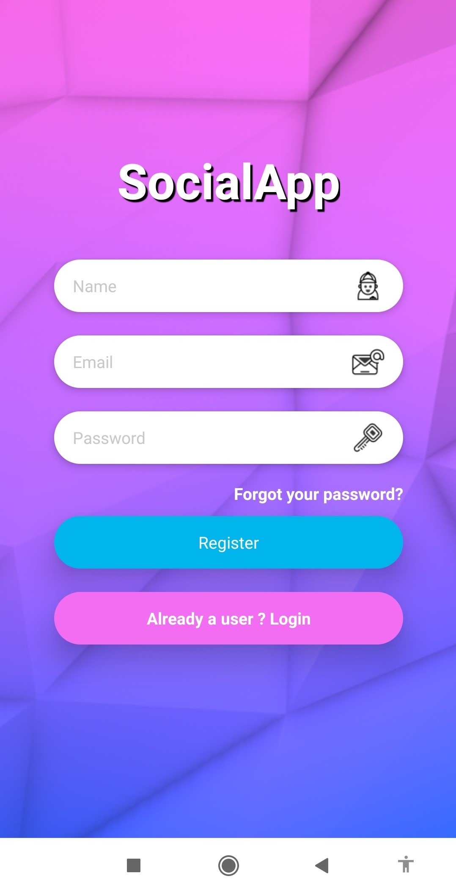
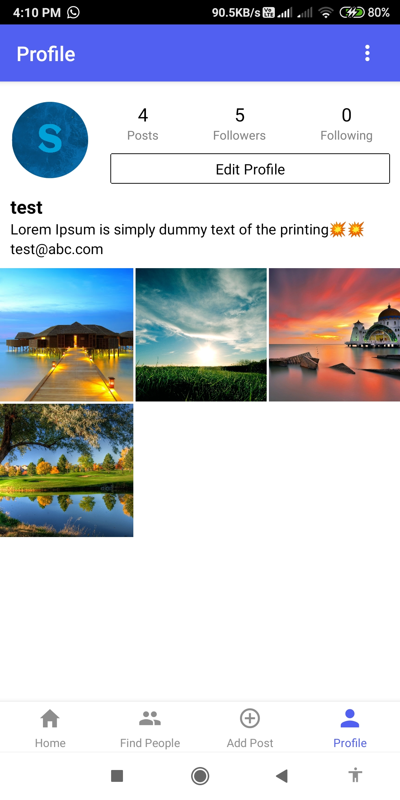
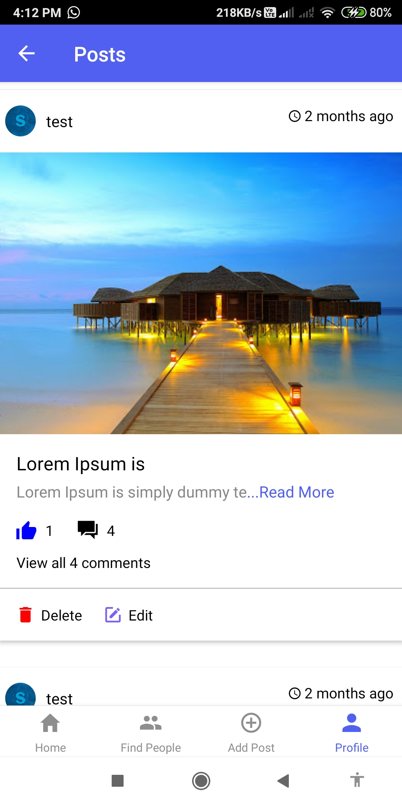
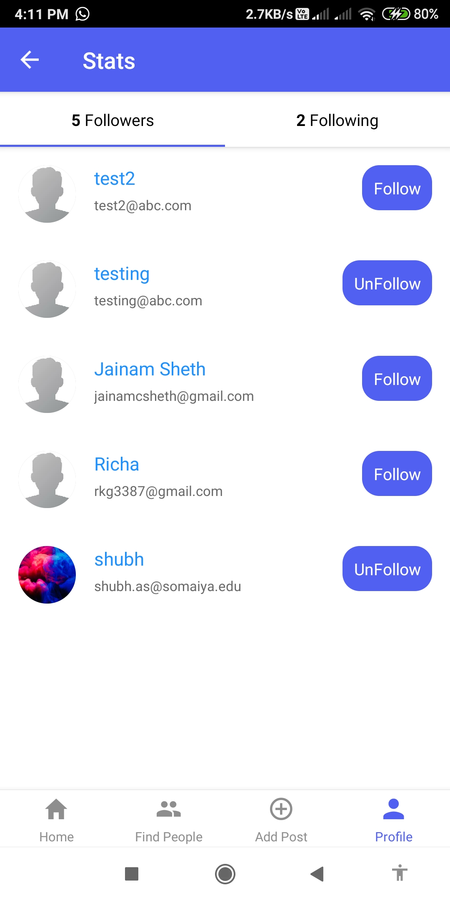
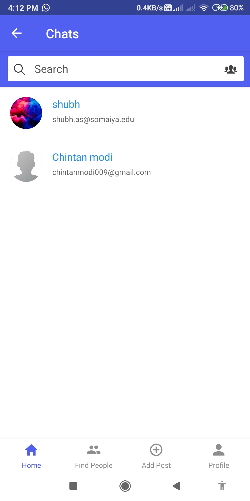
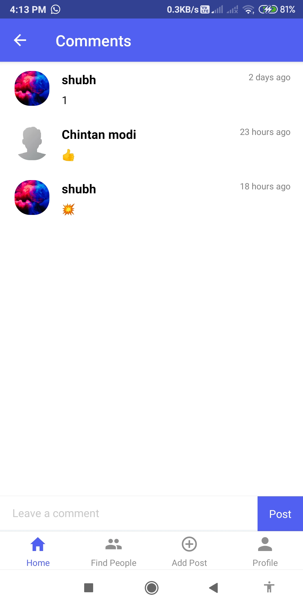
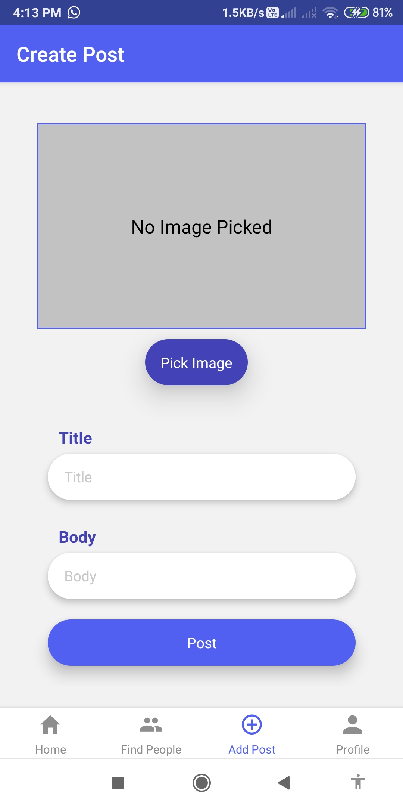

 

SocialApp-React-Native

## Pages

* Login / Signup.
* Forgot password.
* Edit your profile.
* Follow / Unfollow users.
* create / edit / delete posts.
* create / delete comments.
* Like / Unlike posts.
* Personal chat with users.
* Notifications on new messages.

## Images of App

<h4 align="center">Signup Screen &nbsp&nbsp&nbsp&nbsp | &nbsp&nbsp&nbsp&nbsp Home Screen &nbsp&nbsp&nbsp&nbsp | &nbsp&nbsp&nbsp&nbsp Profile Screen</h4>

<h4 align="center">User Posts Screen &nbsp&nbsp&nbsp&nbsp | &nbsp&nbsp&nbsp&nbsp User Stats Screen &nbsp&nbsp&nbsp&nbsp | &nbsp&nbsp&nbsp&nbsp Find People Screen</h4>

<h4 align="center">User Chats List Screen &nbsp&nbsp&nbsp&nbsp | &nbsp&nbsp&nbsp&nbsp Chat Screen &nbsp&nbsp&nbsp&nbsp | &nbsp&nbsp&nbsp&nbsp Comments Screen</h4>

<h4 align="center">Create Post Screen &nbsp&nbsp&nbsp&nbsp | &nbsp&nbsp&nbsp&nbsp Notification on new message</h4>

